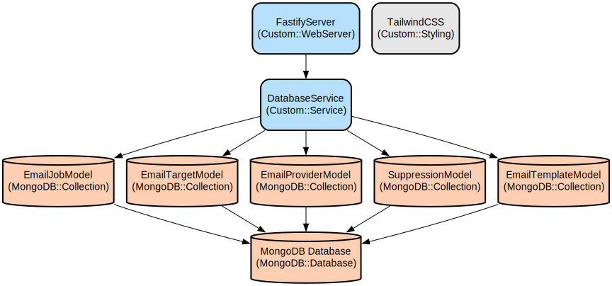

# Email Dispatch Service: A Multi-Provider Email Management System

A robust and scalable email dispatch service that intelligently manages multiple email providers, handles high-volume email sending, and provides comprehensive monitoring capabilities. The system automatically rotates between providers, handles failures gracefully, and offers detailed analytics and monitoring.

This project combines a modern React-based frontend with a powerful Node.js/Fastify backend to create a complete email management solution. It supports multiple email service providers (Brevo, SendGrid, Mailjet, etc.), manages quotas, provides real-time monitoring, and includes a template system for standardized communications.

## Repository Structure
```
.
├── client/                      # Frontend React application
│   ├── src/
│   │   ├── components/         # Reusable UI components including shadcn/ui library
│   │   ├── pages/             # Main application pages (Dashboard, JobMonitor, etc.)
│   │   ├── services/          # API service layer for backend communication
│   │   └── types/             # TypeScript type definitions
│   └── public/                # Static assets
└── server/                     # Backend Fastify application
    ├── src/
    │   ├── models/            # MongoDB data models
    │   ├── routes/            # API route handlers
    │   ├── services/          # Core business logic services
    │   └── types/             # TypeScript interfaces
    └── docs/                  # System documentation and guides
```

## Usage Instructions
### Prerequisites
- Node.js v16 or higher
- MongoDB v4.4 or higher
- RabbitMQ v3.8 or higher
- Email provider API keys (Brevo, SendGrid, Mailjet, etc.)

### Installation

1. Clone the repository:
```bash
git clone <repository-url>
cd email-dispatch-service
```

2. Install server dependencies:
```bash
cd server
npm install
cp environment-template.txt .env
# Configure your .env file with necessary credentials
```

3. Install client dependencies:
```bash
cd ../client
npm install
```

### Quick Start
1. Start the server:
```bash
cd server
npm run dev
```

2. Start the client:
```bash
cd client
npm run dev
```

3. Access the dashboard at `http://localhost:8080`

### More Detailed Examples

1. Setting up an email provider:
```typescript
const provider = {
  name: 'Brevo Test',
  type: 'brevo',
  apiKey: 'your-api-key',
  dailyQuota: 100
};

await axios.post('http://localhost:3000/providers/create', provider);
```

2. Sending an email:
```typescript
const emailJob = {
  subject: 'Test Email',
  body: '<h1>Hello World</h1>',
  recipients: ['test@example.com'],
  metadata: { campaign: 'test' }
};

await axios.post('http://localhost:3000/emails/send', emailJob);
```

### Troubleshooting

1. Provider Connection Issues
- Problem: Email provider not connecting
- Solution: 
  ```bash
  # Check provider status
  curl http://localhost:3000/providers/status/{providerId}
  # Verify API key in .env file
  ```

2. Email Job Failures
- Enable debug mode in .env:
  ```
  DEBUG_MODE=true
  DEBUG_EMAIL_DIR=./debug-emails
  ```
- Check debug logs in `./debug-emails` directory

## Data Flow
The system processes emails through multiple stages, from submission to delivery.

```ascii
[Client] -> [API Server] -> [Queue Service] -> [Email Worker]
                                                    |
                              [Provider N] <----- [Provider Service]
                              [Provider 2] <-----|
                              [Provider 1] <-----|
```

Key interactions:
- Client submits email jobs through the API
- Jobs are queued in RabbitMQ for processing
- Email Worker processes jobs and selects appropriate providers
- Provider Service manages provider rotation and quota tracking
- Failed deliveries are automatically retried with different providers
- Webhook events update email status in real-time

## Infrastructure


The system uses the following key resources:

MongoDB Collections:
- `emailJobs`: Stores email job metadata and status
- `emailTargets`: Tracks individual email recipients
- `emailProviders`: Manages provider configurations
- `suppressions`: Maintains suppression list

RabbitMQ Queues:
- `email-jobs`: Main job processing queue
- `retry-jobs`: Queue for failed job retries
- `webhook-events`: Queue for processing provider webhooks