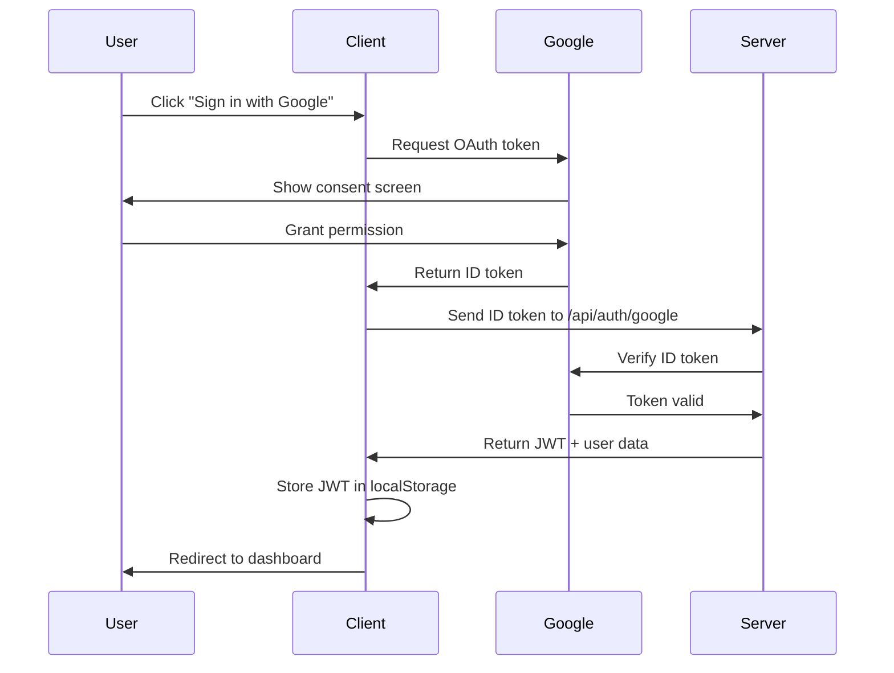
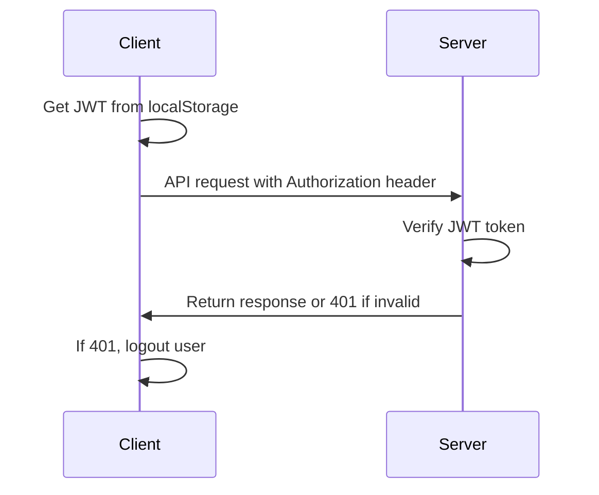

# Client-Side Authentication Implementation Guide

## Overview

This guide covers the complete client-side Google OAuth authentication implementation for the Email Dispatcher application. The system provides secure authentication with JWT token management, automatic token refresh, and a clean user interface.

## 🔧 Setup Instructions

### 1. Environment Variables

Create a `.env.development` file in the client directory:

```bash
# API Configuration
VITE_API_URL=http://localhost:4000/api

# Google OAuth Configuration
VITE_GOOGLE_CLIENT_ID=your-google-client-id.apps.googleusercontent.com

# Environment
VITE_NODE_ENV=development
```

### 2. Google OAuth Setup

1. Go to [Google Cloud Console](https://console.cloud.google.com/)
2. Create a new project or select existing
3. Enable the Google+ API
4. Create OAuth 2.0 credentials:
   - Application type: Web application
   - Authorized JavaScript origins: `http://localhost:5173` (for development)
   - Authorized redirect URIs: `http://localhost:5173` (for development)
5. Copy the Client ID to your `.env.development` file

### 3. Install Dependencies

The following packages are already installed:
- `google-auth-library` - Google OAuth verification
- `jwt-decode` - JWT token decoding
- `@google-cloud/local-auth` - Google authentication utilities

## 🏗️ Architecture

### Components Structure

```
src/
├── contexts/
│   └── AuthContext.tsx          # Authentication context provider
├── services/
│   └── authService.ts           # Authentication API service
├── hooks/
│   └── useApi.ts               # Authenticated API calls hook
├── components/
│   ├── ProtectedRoute.tsx      # Route protection component
│   └── UserProfile.tsx         # User profile dropdown
├── pages/
│   └── Login.tsx               # Login page with Google OAuth
└── types/
    └── auth.ts                 # Authentication type definitions
```

## 🔐 Authentication Flow

### 1. Login Process



### 2. Authenticated Requests



## 🎨 User Interface

### Login Page Features

- **Clean, modern design** with gradient background
- **Feature highlights** showcasing app benefits
- **Google Sign-In button** with official styling
- **Development login form** (development mode only)
- **Responsive design** for mobile and desktop

### User Profile Component

- **Avatar display** with fallback initials
- **Role badges** (Admin/User)
- **Profile editing** modal
- **Settings access**
- **Logout functionality**

## 🔒 Security Features

### Token Management

- **Automatic token refresh** every 6 days
- **Secure storage** in localStorage
- **Token verification** on app initialization
- **Automatic logout** on token expiration

### Route Protection

- **ProtectedRoute component** for authenticated pages
- **Role-based access control** (Admin/User)
- **Automatic redirects** to login when unauthenticated

### API Security

- **Automatic auth headers** on API calls
- **Token validation** on each request
- **Error handling** for auth failures

## 📱 Usage Examples

### Using Authentication Context

```tsx
import { useAuth } from '@/contexts/AuthContext';

const MyComponent = () => {
  const { user, isAuthenticated, logout } = useAuth();

  if (!isAuthenticated) {
    return <div>Please log in</div>;
  }

  return (
    <div>
      <h1>Welcome, {user.name}!</h1>
      <button onClick={logout}>Logout</button>
    </div>
  );
};
```

### Making Authenticated API Calls

```tsx
import { useApi } from '@/hooks/useApi';

const MyComponent = () => {
  const { get, post } = useApi();

  const fetchData = async () => {
    try {
      const response = await get('/user/profile');
      const data = await response.json();
      console.log(data);
    } catch (error) {
      console.error('API call failed:', error);
    }
  };

  const submitData = async (formData) => {
    try {
      const response = await post('/user/update', formData);
      const result = await response.json();
      console.log(result);
    } catch (error) {
      console.error('Submit failed:', error);
    }
  };

  return (
    <div>
      <button onClick={fetchData}>Fetch Data</button>
      <button onClick={() => submitData({ name: 'New Name' })}>
        Submit Data
      </button>
    </div>
  );
};
```

### Protecting Routes

```tsx
import ProtectedRoute from '@/components/ProtectedRoute';

const App = () => {
  return (
    <Routes>
      <Route path="/login" element={<Login />} />
      <Route path="/dashboard" element={
        <ProtectedRoute>
          <Dashboard />
        </ProtectedRoute>
      } />
      <Route path="/admin" element={
        <ProtectedRoute requireAdmin>
          <AdminPanel />
        </ProtectedRoute>
      } />
    </Routes>
  );
};
```

## 🛠️ Development Features

### Development Login

For testing without Google OAuth setup:

```tsx
// Available in development mode only
const handleDevLogin = async () => {
  await loginDev('dev@example.com', 'Developer');
};
```

### Environment Detection

```tsx
const isDevelopment = import.meta.env.DEV;
const apiUrl = import.meta.env.VITE_API_URL;
const googleClientId = import.meta.env.VITE_GOOGLE_CLIENT_ID;
```

## 🔄 State Management

### Authentication State

```tsx
interface AuthContextType {
  user: User | null;           // Current user data
  token: string | null;        // JWT token
  isLoading: boolean;          // Loading state
  isAuthenticated: boolean;    // Auth status
  login: (idToken: string) => Promise<void>;
  loginDev: (email: string, name?: string) => Promise<void>;
  logout: () => void;
  updateProfile: (data: Partial<User>) => Promise<void>;
  refreshToken: () => Promise<void>;
}
```

### User Data Structure

```tsx
interface User {
  id: string;
  email: string;
  name: string;
  avatar?: string;
  role: 'user' | 'admin';
  isActive: boolean;
}
```

## 🚀 Production Deployment

### Environment Variables for Production

```bash
VITE_API_URL=https://your-api-domain.com/api
VITE_GOOGLE_CLIENT_ID=your-production-google-client-id
VITE_NODE_ENV=production
```

### Security Considerations

1. **HTTPS Only**: Always use HTTPS in production
2. **Secure Origins**: Configure Google OAuth with production domains
3. **Token Storage**: Consider using httpOnly cookies for enhanced security
4. **CSP Headers**: Implement Content Security Policy
5. **Environment Variables**: Never commit real credentials to version control

## 🐛 Troubleshooting

### Common Issues

1. **"Google is not defined" error**
   - Ensure Google Sign-In script is loaded
   - Check network connectivity
   - Verify Google Client ID

2. **"Invalid token" errors**
   - Check server-side Google Client ID configuration
   - Verify token hasn't expired
   - Ensure proper CORS configuration

3. **Authentication loops**
   - Clear localStorage: `localStorage.clear()`
   - Check token expiration
   - Verify server authentication endpoints

4. **Development login not working**
   - Ensure `NODE_ENV=development`
   - Check server development endpoints are enabled
   - Verify API URL configuration

### Debug Mode

Enable debug logging:

```tsx
// In development, authentication errors are logged to console
console.log('Auth state:', { user, token, isAuthenticated });
```

## 📋 Testing

### Manual Testing Checklist

- [ ] Google OAuth login works
- [ ] Development login works (dev mode)
- [ ] User profile displays correctly
- [ ] Profile editing works
- [ ] Token refresh works automatically
- [ ] Logout clears all data
- [ ] Protected routes redirect when unauthenticated
- [ ] API calls include auth headers
- [ ] Error handling works for auth failures

### Test Accounts

For development testing:
- Email: `dev@example.com`
- Name: `Developer User`

## 🔮 Future Enhancements

### Planned Features

1. **Remember Me** functionality
2. **Multi-factor authentication** support
3. **Social login** with other providers
4. **Session management** improvements
5. **Offline authentication** handling

### Performance Optimizations

1. **Token caching** strategies
2. **Lazy loading** of auth components
3. **Background token refresh**
4. **Connection retry logic**

---

The authentication system is now fully implemented and ready for production use. The system provides enterprise-grade security while maintaining a smooth user experience and developer-friendly features for testing and debugging.
